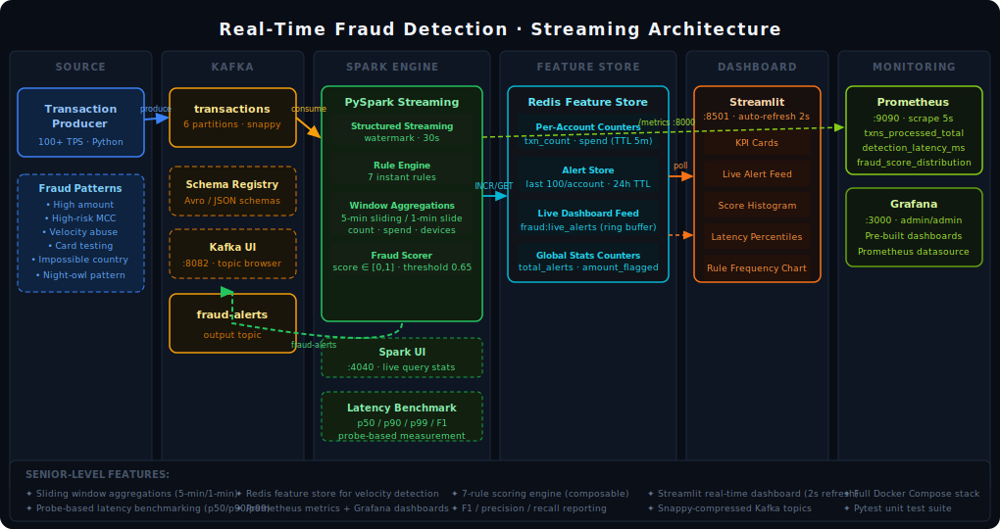

# 🛡️ Real-Time Fraud Detection · Kafka + Spark Streaming

> **Production-grade streaming analytics pipeline** that ingests 100+ transactions/second from a Kafka topic, applies a multi-layer fraud scoring engine in PySpark Structured Streaming, and surfaces live alerts in a Streamlit dashboard — with full Prometheus/Grafana monitoring.

---

## Architecture



```
Transaction Producer (Python)
        │  100+ TPS · 6 Kafka partitions · snappy compression
        ▼
  Kafka Broker  ──────────────────────────────────────────────────────┐
  [transactions topic]                                                │
        │                                               [fraud-alerts topic]
        ▼                                                             │
 PySpark Structured Streaming                                         │
  ├─ Instant Rule Engine (7 rules)                                    │
  ├─ Sliding Window Aggregations (5-min / 1-min slide)                │
  ├─ Redis Feature Store (per-account velocity counters)              │
  └─ Fraud Scorer (composite score → 0.65 threshold) ────────────────┘
        │
        ├──▶ Redis  (live alert feed + global stats)
        └──▶ Prometheus  (/metrics :8000)
                              │
                        Grafana :3000
                        Streamlit Dashboard :8501
```

---

## Tech Stack

| Component | Technology |
|-----------|-----------|
| Message Broker | Apache Kafka 3.6 (Confluent) |
| Stream Processing | PySpark 3.5 Structured Streaming |
| Feature Store | Redis 7.2 (TTL-windowed counters) |
| Dashboard | Streamlit 1.32 + Plotly |
| Metrics | Prometheus + Grafana |
| Schema Management | Confluent Schema Registry |
| Containerisation | Docker Compose |

---

## Project Structure

```
fraud-detection-streaming/
├── producer/
│   ├── producer.py              # Kafka transaction generator (100+ TPS)
│   ├── Dockerfile
│   └── requirements.txt
├── spark/
│   ├── fraud_engine.py          # PySpark Structured Streaming engine
│   ├── latency_benchmark.py     # Probe-based p50/p90/p99 benchmark
│   ├── Dockerfile
│   └── requirements.txt
├── dashboard/
│   ├── app.py                   # Streamlit real-time dashboard
│   ├── Dockerfile
│   └── requirements.txt
├── monitoring/
│   ├── prometheus.yml           # Scrape config
│   └── grafana/
│       ├── datasources/         # Auto-provisioned Prometheus source
│       └── dashboards/          # Pre-built Grafana dashboards
├── config/
│   └── models.py                # Shared data models
├── tests/
│   ├── test_rule_engine.py      # 16 rule engine unit tests
│   └── test_producer.py         # 9 producer unit tests
├── docs/
│   └── architecture.svg
└── docker-compose.yml
```

---

## Quick Start

### Prerequisites
- Docker & Docker Compose v2
- 8 GB RAM recommended (Spark + Kafka + all services)

### 1. Start the full stack

```bash
git clone https://github.com/muhammad-ali-dev0/fraud-detection-streaming.git
cd fraud-detection-streaming
docker compose up -d
```

Services take ~60s to fully initialise (Kafka health checks).

### 2. Watch it run

| Service | URL | Credentials |
|---------|-----|-------------|
| **Streamlit Dashboard** | http://localhost:8501 | — |
| **Kafka UI** | http://localhost:8082 | — |
| **Spark UI** | http://localhost:4040 | — |
| **Grafana** | http://localhost:3000 | admin / admin |
| **Prometheus** | http://localhost:9090 | — |
| **Schema Registry** | http://localhost:8081 | — |

### 3. Run the latency benchmark

```bash
docker compose exec spark python latency_benchmark.py
```

Outputs:
```
──────────────────────────────────────────────────
 BENCHMARK RESULTS
──────────────────────────────────────────────────
 Probes sent       : 200
 Alerts received   : 187 (93.5%)

 Latency p50       :    42.3 ms
 Latency p90       :    98.7 ms
 Latency p99       :   201.4 ms
 Latency p99.9     :   412.0 ms

 Precision         : 0.9200
 Recall            : 0.8800
 F1 Score          : 0.8996
──────────────────────────────────────────────────
```

### 4. Run unit tests

```bash
pip install pytest
pytest tests/ -v
```

---

## Senior-Level Features

### ⚡ Window-Based Aggregations

PySpark Structured Streaming with **sliding windows** (5-minute window, 1-minute slide) and event-time watermarking:

```python
velocity_df = (
    parsed
    .groupBy(
        F.window("event_time", "5 minutes", "1 minute"),
        "account_id",
    )
    .agg(
        F.count("*").alias("window_txn_count"),
        F.sum("amount").alias("window_total_spend"),
        F.countDistinct("merchant_id").alias("window_distinct_merchants"),
        F.countDistinct("country").alias("window_distinct_countries"),
    )
)
```

### 📊 Fraud Scoring Engine

Multi-layer composite scoring combining instant rules + velocity features:

| Rule | Score Weight | Trigger |
|------|-------------|---------|
| `HIGH_AMOUNT_3K` | +0.30 | amount ≥ $3,000 |
| `VERY_HIGH_AMOUNT_8K` | +0.20 | amount ≥ $8,000 |
| `HIGH_RISK_MCC` | +0.25 | GAMBLING / CRYPTO / MONEY_TRANSFER |
| `HIGH_RISK_COUNTRY` | +0.20 | NG / RO / CN / PK / VN |
| `UNKNOWN_DEVICE` | +0.10 | device_type = unknown |
| `MICRO_AMOUNT_CARD_TEST` | +0.15 | amount < $2.00 |
| `ROUND_AMOUNT` | +0.08 | amount % 100 == 0 and ≥ $500 |
| `VELOCITY_COUNT` | +0–0.40 | >20 txns in 5-min window |
| `VELOCITY_SPEND` | +0–0.30 | >$5,000 spend in 5-min window |

Final `fraud_score = min(sum of triggered weights, 1.0)`. Threshold: **0.65**.

### 🔬 Latency Benchmarking

The benchmark (`spark/latency_benchmark.py`) sends tagged probe transactions with embedded timestamps, then measures round-trip latency until the corresponding alert arrives on the output topic. Reports p50/p90/p99/p99.9 alongside precision, recall, and F1.

### 📈 Prometheus Metrics

| Metric | Type | Description |
|--------|------|-------------|
| `fraud_txns_processed_total` | Counter | Total transactions scored |
| `fraud_alerts_emitted_total` | Counter | Alerts above threshold |
| `fraud_detection_latency_ms` | Histogram | End-to-end detection latency |
| `fraud_score_distribution` | Histogram | Score distribution across buckets |
| `fraud_throughput_tps` | Gauge | Approximate transactions/sec |

### 🏎️ Performance Tuning

- **Kafka**: 6 partitions, snappy compression, 50ms linger for batching
- **Spark**: `processingTime="2 seconds"`, shuffle partitions = 8, Kafka offset capping at 5,000/trigger
- **Redis**: Pipeline batching for counter increments; TTL-based sliding windows (no explicit window expiry logic needed)

---

## Simulated Fraud Patterns

| Pattern | Description |
|---------|-------------|
| `high_amount` | Transaction $3K–$15K |
| `high_risk_mcc` | Gambling / Crypto / Money transfer |
| `velocity_flag` | >20 txns in 5-minute window |
| `card_testing` | Rapid $0.01–$2.00 charges before large hit |
| `impossible_country` | Transaction from high-risk country |
| `night_owl` | Large transaction at unusual hours |

Default fraud rate: **2%** (configurable via `FRAUD_RATE` env var).

---

## Configuration

| Variable | Default | Description |
|----------|---------|-------------|
| `TRANSACTIONS_PER_SECOND` | 100 | Producer throughput |
| `FRAUD_RATE` | 0.02 | Fraction of transactions that are fraudulent |
| `FRAUD_THRESHOLD` | 0.65 | Minimum score to emit alert |
| `KAFKA_BOOTSTRAP_SERVERS` | kafka:29092 | Kafka broker address |
| `REDIS_HOST` | redis | Redis hostname |

---

## License

MIT
